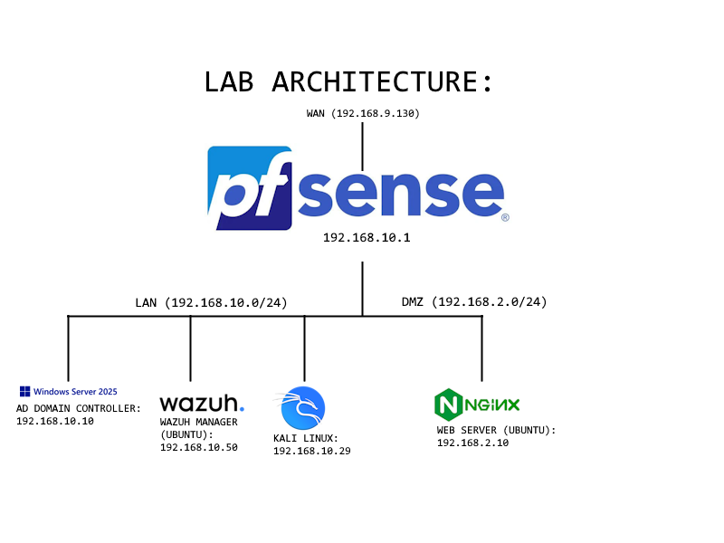

# Cybersecurity Home Lab
A personal cybersecurity home lab built in VMware Workstation on a custom-built desktop. Designed to simulate a segmented enterprise network and to learn and practice real IT and security operations including network configuration, system administration, Active Directory management, attack simulations, SIEM, and incident response. All attacks were conducted in an isolated lab environment and documented as formal incident reports. Also includes session logs and screenshots.

## Environment
* Host: Custom-built desktop
* CPU: Ryzen 7 7800X3D
* RAM: 32GB
* Hypervisor: VMware Workstation

## Topology

## What I've Done So Far
* Designed and deployed segmented network infrastructure with pfSense, including firewall rules, DMZ isolation, and inter-segment traffic control
* Configured Wazuh SIEM with endpoint agents and correlation rules for centralized detection and alerting
* Deployed Snort IDS and integrated alerts into Wazuh via syslog
* Simulated attack chains including directory traversal, SSH brute force, and Active Directory credential harvesting
* Documented attack simulations as formal incident reports with detection analysis, impact assessment, and recommendations

## Coming Soon
* More attack simulations and incident reports
* Honeypot deployment
* LAN-side IDS coverage
* DVWA vulnerable web application for SQL injection and XSS simulation
* AWS cloud security lab

## Certifications
* CompTIA Network+ (N10-009)
* CompTIA Security+ (SY0-701)

## [LinkedIn](https://www.linkedin.com/in/brody-dahl-8072a6406/)
